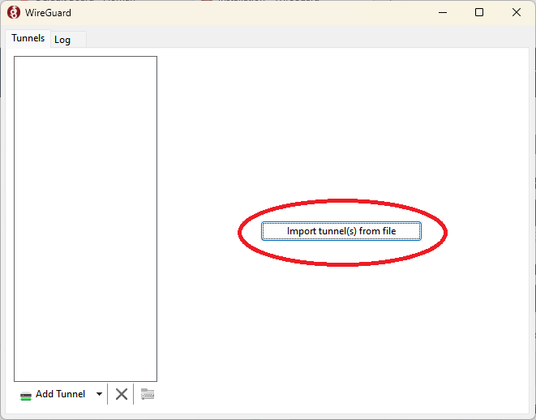

## Step 1 - Installation und Setup von WireGuard
1. Lade dir den passenden installer für dein Betriebssystem herunter: [WireGuard download](https://www.wireguard.com/install/)
2. Nach der installation, muss die VPN verbindung konfiguriet werden. Jeder wird seine eigene VPN datei von mir zugeschickt bekommen. Diese datei wird wie folgt impotiert:

3. Jetzt ist der VPN-Tunnel zum Mäuse Fluppen Server importiert und bereit zur nutzung. Das Wireguard fenster sollte jetzt ca wie folgt aussehen.

4.
>[!WARNING]
>Bitte wieder ausschalten nachdem Spielen auf dem Server!