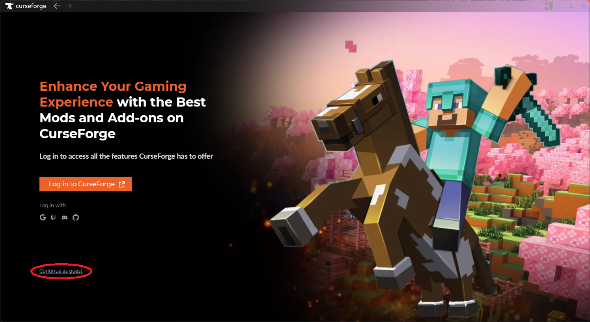
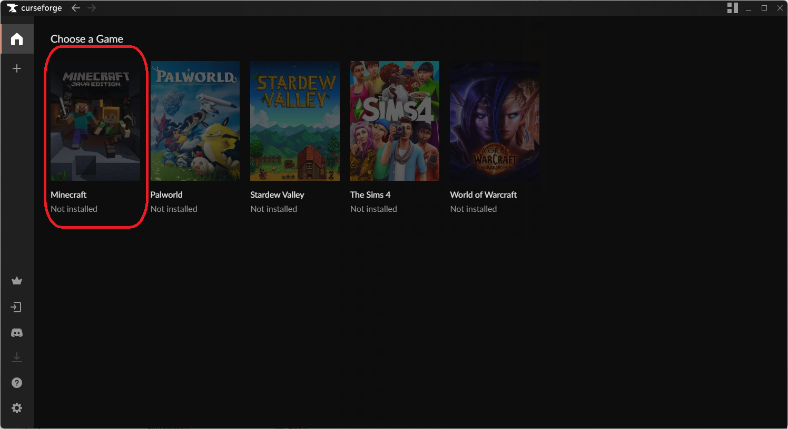
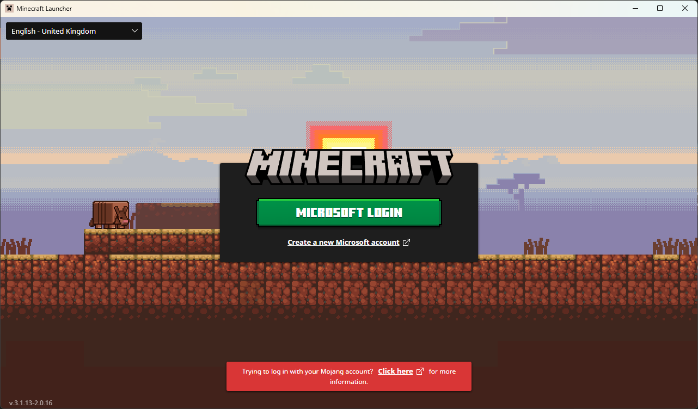
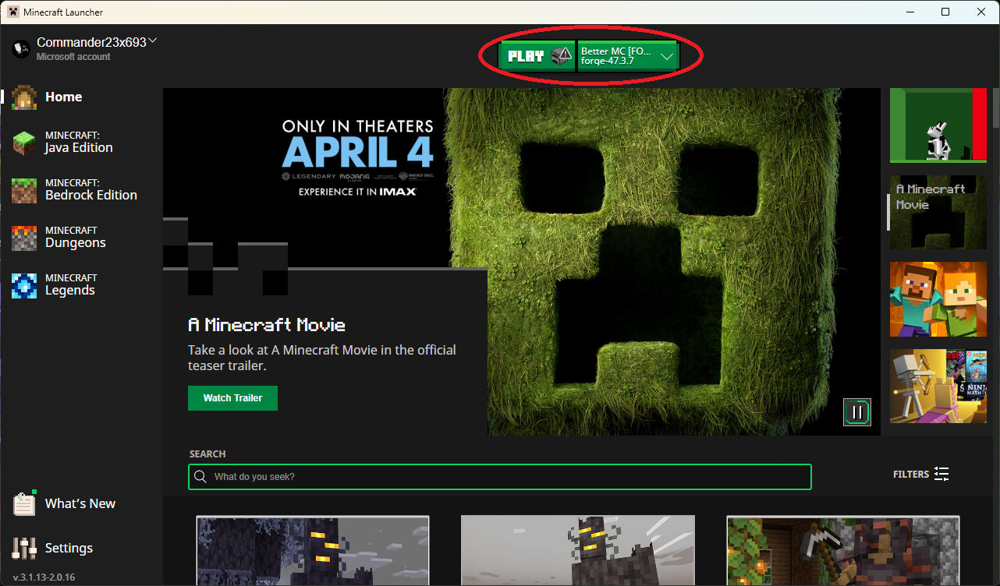
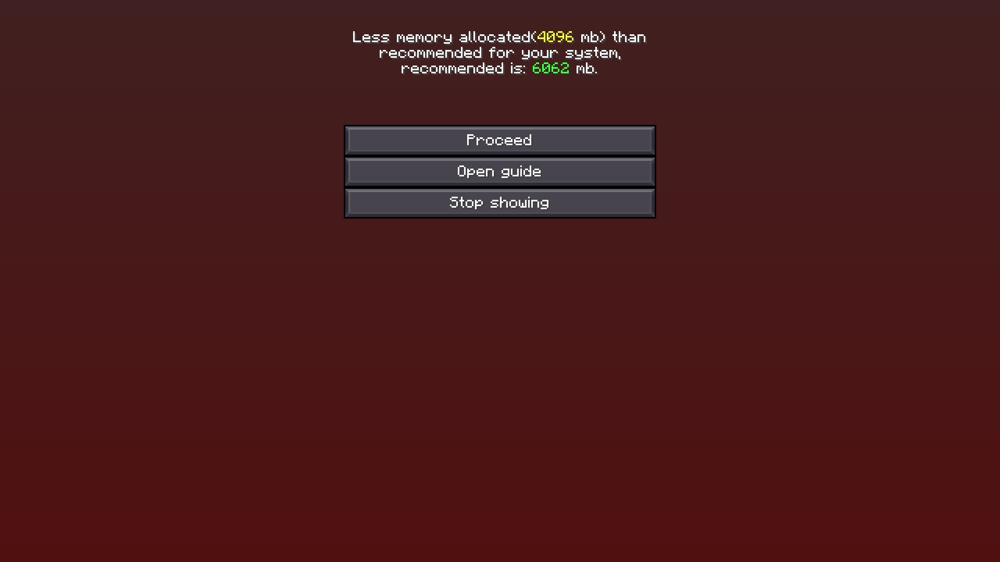
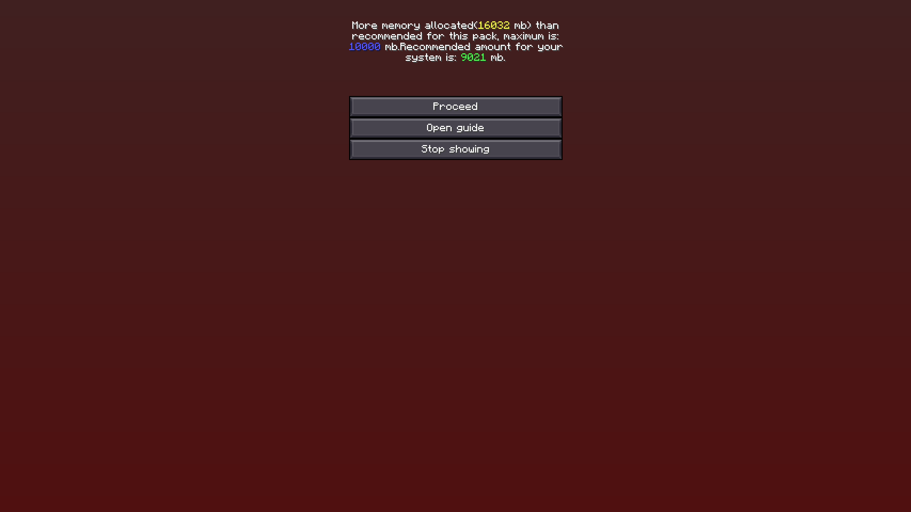

# Mäuse Fluppen Server 2024

Modpack:
Better MC 4 (BMC4)

## Step 2 - Installation und Setup von CurseForge
### Downloadlinks
>[Windows](https://download.overwolf.com/install/Download?PartnerId=4047&utm_term=eyJkb21haW4iOiJjZi13ZWIifQ%3D%3D) | 
[Mac](https://curseforge.overwolf.com/downloads/curseforge-latest.dmg)
lade dir den installer von curseforge herunter und installiere das Programm
### Modpack Mit CurseForge Installieren
Nachdem Die Installation Von CurseForge Abgeschlossen ist wähle "*Continue as Guest*" bzw. "*weiter als Gast*" aus.

Suche bei Den Modpacks nach "BMC4" und installiere das Mod-Pack.
>[!warning] Achte Darauf, dass du das mit [Forge] markierte pack installierst!

Nach der installation musst du einfgach nur auf "*Play*" klicken. dann startet sich der normale Minecraft Launcher mit dem gemoddeten Profil schon geladen.  

## Step 3 - Let's Play
Logge Dich in den Normalen Minecraft Launcher ein, falls due nicht schon bist.

>[!TIP] Stelle sicher, dass das Mod-Profil ausgewählt ist.

Klicke auf Play :)

nach dem ersten start kann es sein dass dich das spiel aufforderd die menge des zugewiesenen arbeitsschpeichers zu ändern
>[!IMPORTANT] Examples

>
>

Server IP: commander23.sytes.net:25565