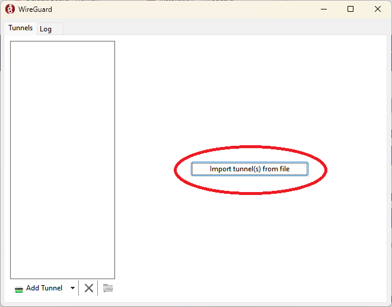
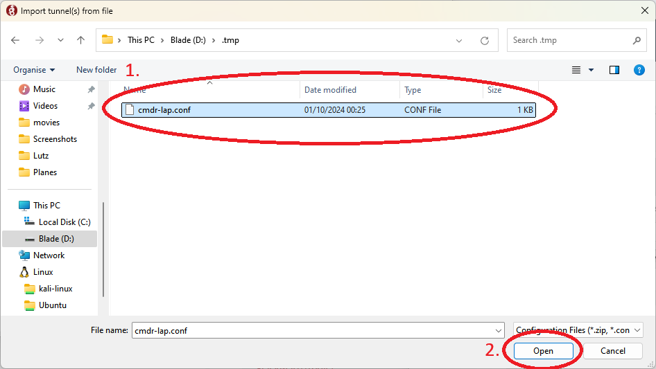

# Mäuse Fluppen Server 2024

Modpack:
Better MC 4 (BMC4)

# Schritt 1: Installation und Setup von WireGuard
1. Lade dir den passenden installer für dein Betriebssystem herunter: [WireGuard download](https://www.wireguard.com/install/)
2. Nach der installation, muss die VPN verbindung konfiguriet werden. Jeder bekommt seine eigene VPN datei bekommen. Diese datei wird wie folgt impotiert,

