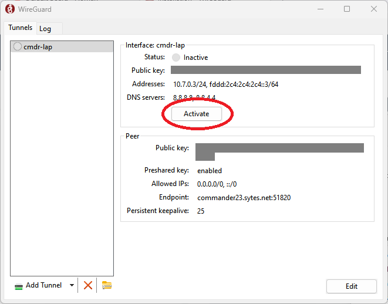

# Mäuse Fluppen Server 2024

Modpack:
Better MC 4 (BMC4)

## Schritt 1: Installation und Setup von WireGuard
1. Lade dir den passenden installer für dein Betriebssystem herunter: [WireGuard download](https://www.wireguard.com/install/)
2. Nach der installation, muss die VPN verbindung konfiguriet werden. Jeder bekommt seine eigene VPN datei bekommen. Diese datei wird wie folgt impotiert,

3. Jetzt ist der VPN-Tunnel zum Mäuse Fluppen Server importiert und bereit zur nutzung. Das Wireguard fenster sollte jetzt ca wie folgt aussehen

4.
>[!Warning]
>Bitte wieder ausschalten nachdem Spielen auf dem Server

## Step 2/3: Mod Launcher
### Downloadlinks
[Windows](https://download.overwolf.com/install/Download?PartnerId=4047&utm_term=eyJkb21haW4iOiJjZi13ZWIifQ%3D%3D)
[Mac](https://curseforge.overwolf.com/downloads/curseforge-latest.dmg)
### Installation

