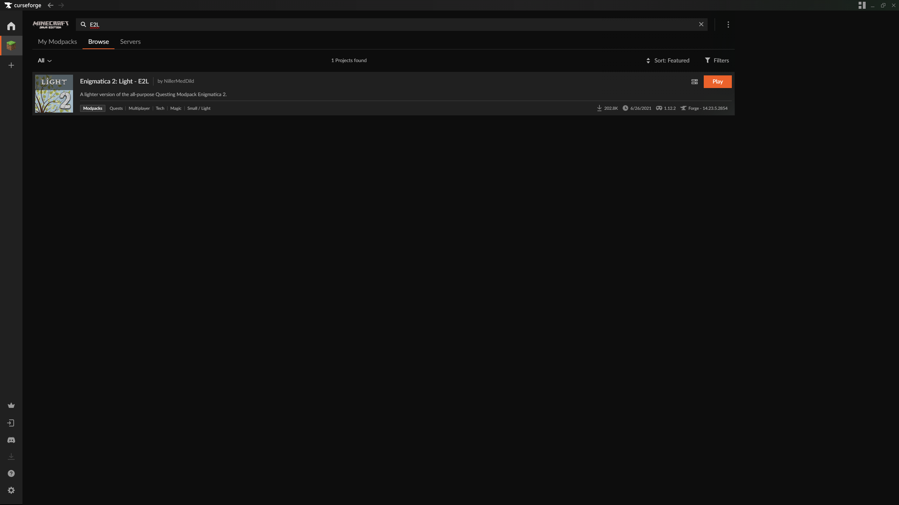

# Mäuse Fluppen Server 2024

Modpack:
Enigmatica 2 Light (E2L)

## Step 2 - Installation und Setup von CurseForge
### Downloadlinks
>[Windows](https://download.overwolf.com/install/Download?PartnerId=4047&utm_term=eyJkb21haW4iOiJjZi13ZWIifQ%3D%3D) | 
[Mac](https://curseforge.overwolf.com/downloads/curseforge-latest.dmg)
lade dir den installer von curseforge herunter und installiere das Programm
### Modpack Mit CurseForge Installieren
Nachdem Die Installation Von CurseForge Abgeschlossen ist wähle "*Continue as Guest*" bzw. "*weiter als Gast*" aus.

Wähle als Modding Ordner einfach Die standart konfiguration aus
Suche bei Den Modpacks nach "E2L" und installiere das Mod-Pack.

> [!warning] Achte Darauf, dass du das mit [Forge] markierte pack installierst!

> [!warning] Stelle Sicher, dass du Java installiert hast. hier der entsprechende download link [Java-download](https://www.java.com/de/download/manual.jsp)

Nach der installation musst du einfgach nur auf "*Play*" klicken. dann startet sich der normale Minecraft Launcher mit dem gemoddeten Profil schon geladen.  

## Step 3 - Let's Play
Logge Dich in den Normalen Minecraft Launcher ein, falls due nicht schon bist.

>[!TIP] Stelle sicher, dass das Mod-Profil ausgewählt ist.

Klicke auf Play :)

nach dem ersten start kann es sein dass dich das spiel aufforderd die menge des zugewiesenen arbeitsschpeichers zu ändern
>[!IMPORTANT] Examples

>
>

Server IP: commander23.sytes.net:25565

> [!NOTE]
> [Windows](https://download.overwolf.com/install/Download?PartnerId=4047&utm_term=eyJkb21haW4iOiJjZi13ZWIifQ%3D%3D) | 
> [Mac](https://curseforge.overwolf.com/downloads/curseforge-latest.dmg)

> [!TIP]
> Optional information to help a user be more successful.

> [!IMPORTANT]  
> Crucial information necessary for users to succeed.

> [!WARNING]  
> Critical content demanding immediate user attention due to potential risks.

> [!CAUTION]
> Negative potential consequences of an action.